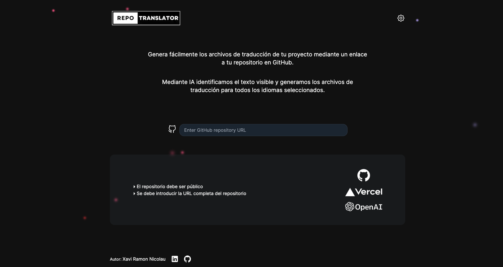

# Repo Translator

Repo Translator es una aplicación web que permite generar fácilmente archivos de traducción para tu proyecto mediante un enlace a tu repositorio en GitHub. Utiliza inteligencia artificial para identificar el texto visible y generar archivos de traducción para todos los idiomas seleccionados.



## Características

- **Generación Automática de Traducciones**: Analiza el contenido de tu repositorio de GitHub y genera archivos de traducción para múltiples idiomas usando IA.
- **Selección de Idiomas**: Permite seleccionar el idioma original del repositorio y añadir idiomas adicionales para la traducción.
- **Descarga de Traducciones**: Descarga los archivos de traducción generados en formato JSON.
- **Personalización de API Key**: Añade tu propia API Key de OpenAI si los tokens de la página se han agotado.

## Tecnologías Utilizadas

- **Next.js**
- **React**
- **TypeScript**
- **Tailwind CSS**
- **Zustand**
- **Vercel SDK AI**
- **OpenAI API**
- **GitHub API**

## Instalación

1. Clona este repositorio en tu máquina local:

   ```bash
   git clone https://github.com/xavirn89/repo-translator.git
   cd repo-translator
   ```

2. Instala las dependencias:

   ```bash
   npm install

   # o

   yarn install
   ```

3. Crea un archivo .env.local en la raíz del proyecto y añade tu API Key de OpenAI:
   ```bash
   NEXT_PUBLIC_OPENAI_API_KEY=tu-api-key-de-openai
   ```

## Uso

1. Inicia el servidor de desarrollo:

   ```bash
   npm run dev

   # o

   yarn dev
   ```

2. Abre tu navegador y ve a `http://localhost:3000`.

## Estructura del Proyecto

- `components/`: Componentes reutilizables de la aplicación.
- `sections/`: Secciones específicas de la aplicación (por ejemplo, header, footer, nav, etc).
- `stores/`: Almacenamiento de estado usando Zustand.
- `utils/`: Utilidades y funciones auxiliares.
- `app/`: Estructura de la app.

## Contacto

Autor: Xavi Ramon Nicolau  
LinkedIn: [Xavi Ramon Nicolau](https://www.linkedin.com/in/xavi-ramon-nicolau-08289a261/)  
GitHub: [xavirn89](https://github.com/xavirn89)
